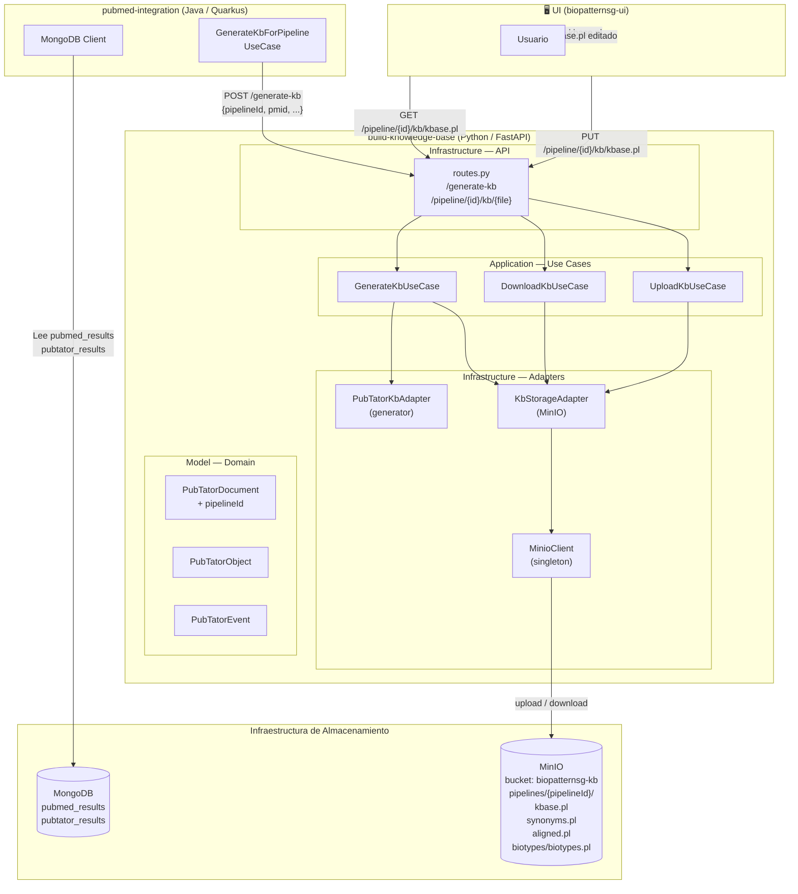

# Arquitectura del Sistema KB — Build Knowledge Base

## Visión General

El sistema construye bases de conocimiento en formato Prolog a partir de resultados de PubTator (anotaciones biomédicas de artículos PubMed). Los archivos generados se almacenan de forma persistente en **MinIO** (object storage S3-compatible), organizados por `pipelineId`. El usuario puede descargarlos, editarlos y re-cargarlos desde la UI.

---

## Diagrama de Arquitectura



---

## Capas de la Aplicación

### Model (Dominio)
Define las entidades y estructuras de datos sin dependencias externas.

| Archivo | Responsabilidad |
|---|---|
| `pubtator.py` | `PubTatorDocument`, `PubTatorObject`, `PubTatorEvent`, `Location` |
| `hello.py` | `HelloMessage` (entidad de demo) |
| `hello_repository.py` | Interfaz `HelloRepositoryInterface` |

### Application (Casos de Uso)
Orquesta la lógica de negocio. No conoce FastAPI ni MinIO directamente.

| Archivo | Responsabilidad |
|---|---|
| `generate_kb_use_case.py` | Genera KB para un documento, acumula en MinIO si hay `pipelineId` |
| `download_kb_use_case.py` | Descarga un archivo KB desde MinIO |
| `upload_kb_use_case.py` | Re-carga un archivo KB editado al MinIO |
| `get_hello_message.py` | Demo: retorna mensaje de saludo |

### Infrastructure (Adaptadores)
Implementaciones concretas de tecnologías externas.

| Archivo | Responsabilidad |
|---|---|
| `api/routes.py` | Endpoints FastAPI |
| `generator/pubtator_kb_adapter.py` | Genera archivos `.pl` a partir de documentos PubTator |
| `storage/minio_client.py` | Cliente MinIO singleton (configurado por env vars) |
| `storage/kb_storage_adapter.py` | Abstracción sobre MinIO: upload, download, exists |
| `repositories/mock_hello_repository.py` | Repositorio mock de demo |

---

## Estructura de Archivos en MinIO

```
bucket: biopatternsg-kb
└── pipelines/
    └── {pipelineId}/
        ├── kbase.pl              ← Base de conocimiento en Prolog
        ├── synonyms.pl           ← Sinónimos de entidades
        ├── aligned.pl            ← Objetos alineados con IDs PubTator
        └── biotypes/
            └── biotypes.pl       ← Identidades biológicas (protein, gene, etc.)
```

---

## Variables de Entorno

Todas las configuraciones sensibles se inyectan como variables de entorno desde Jenkins. No hay credenciales hardcodeadas en el repositorio.

| Variable | Descripción | Ejemplo |
|---|---|---|
| `MINIO_ENDPOINT` | Host y puerto del servidor MinIO | `minio:9000` |
| `MINIO_ACCESS_KEY` | Usuario / Access Key de MinIO | `(desde Jenkins)` |
| `MINIO_SECRET_KEY` | Contraseña / Secret Key de MinIO | `(desde Jenkins)` |
| `MINIO_BUCKET` | Nombre del bucket | `biopatternsg-kb` |

---

## Tecnologías

| Componente | Tecnología |
|---|---|
| API | FastAPI (Python 3.11) |
| Server | Uvicorn |
| Object Storage | MinIO (S3-compatible) |
| SDK MinIO | `minio>=7.2.0` (Python) |
| NLP | NLTK (tokenización de oraciones) |
| CI/CD | Jenkins |
| Containerización | Docker |
