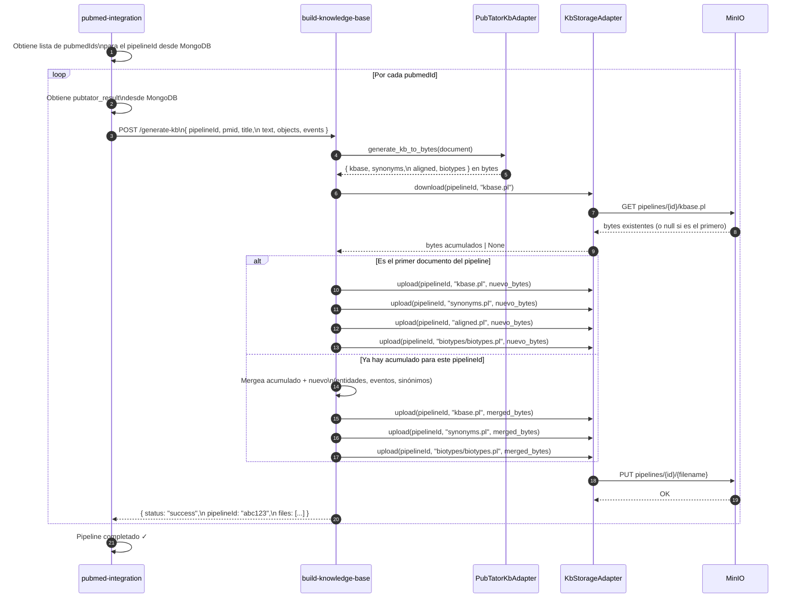
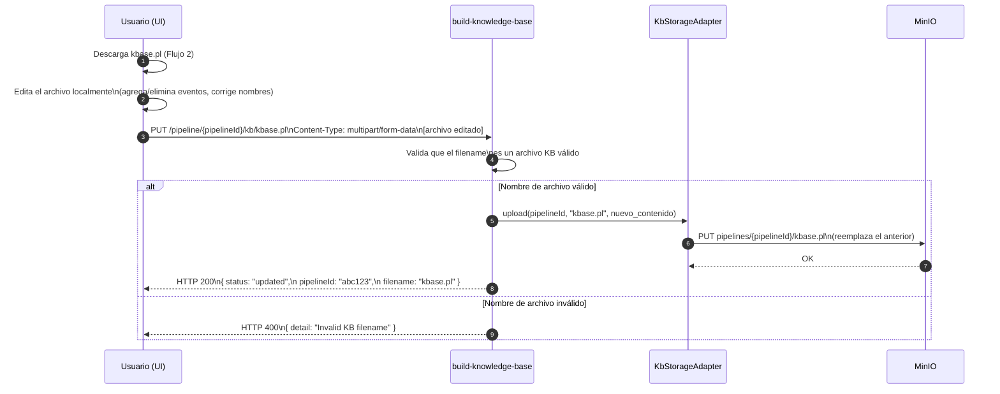

# Flujo del Sistema KB — Build Knowledge Base

## Flujos Principales

El sistema tiene tres flujos bien diferenciados:

1. **Generación acumulativa** — `pubmed-integration` dispara la construcción del KB
2. **Descarga** — el usuario obtiene el archivo `.pl` generado
3. **Re-carga** — el usuario sube su versión editada del archivo

---

## Flujo 1: Generación Acumulativa del KB

Disparado por el microservicio `pubmed-integration` una vez por cada `pubmedId` del pipeline.



### Estado en MinIO al finalizar

Después de procesar N documentos, MinIO contiene los archivos **acumulados** con todas las entidades y eventos de los N artículos PubMed del pipeline:

```
pipelines/abc123/
  ├── kbase.pl           ← eventos de todos los N docs
  ├── synonyms.pl        ← sinónimos de todos los N docs
  ├── aligned.pl         ← alineaciones
  └── biotypes/
      └── biotypes.pl    ← identidades de todos los N docs
```

---

## Flujo 2: Descarga del Archivo KB

El usuario, desde la UI, solicita descargar el `kbase.pl` de su pipeline.

```mermaid
sequenceDiagram
    autonumber
    participant USER as Usuario (UI)
    participant BKB as build-knowledge-base
    participant STORE as KbStorageAdapter
    participant MINIO as MinIO

    USER->>BKB: GET /pipeline/{pipelineId}/kb/kbase.pl

    BKB->>STORE: download(pipelineId, "kbase.pl")
    STORE->>MINIO: GET pipelines/{pipelineId}/kbase.pl
    MINIO-->>STORE: bytes del archivo

    alt Archivo encontrado
        STORE-->>BKB: bytes
        BKB-->>USER: StreamingResponse\nContent-Type: text/plain\nContent-Disposition: attachment;\n filename="kbase.pl"
    else Archivo no encontrado (pipeline no procesado)
        STORE-->>BKB: None
        BKB-->>USER: HTTP 404\n{ detail: "KB not found for pipeline abc123" }
    end
```

### Archivos disponibles para descarga

| URL | Archivo descargado |
|---|---|
| `GET /pipeline/{id}/kb/kbase.pl` | Base de conocimiento Prolog |
| `GET /pipeline/{id}/kb/synonyms.pl` | Sinónimos |
| `GET /pipeline/{id}/kb/aligned.pl` | Alineaciones |
| `GET /pipeline/{id}/kb/biotypes.pl` | Identidades biológicas |

---

## Flujo 3: Re-carga del Archivo Editado por el Usuario

El usuario edita el `kbase.pl` localmente y lo re-carga para usarlo en procesos posteriores.



---

## Endpoints Resumen

| Método | Ruta | Descripción | Quién lo usa |
|---|---|---|---|
| `POST` | `/generate-kb` | Genera/acumula KB para un documento | `pubmed-integration` |
| `GET` | `/pipeline/{id}/kb/{filename}` | Descarga un archivo KB | UI / Usuario |
| `PUT` | `/pipeline/{id}/kb/{filename}` | Re-carga un archivo KB editado | UI / Usuario |
| `GET` | `/hello` | Health check / demo | Monitoreo |

---

## Reglas de Negocio

1. **`pipelineId` es opcional en `/generate-kb`** — si no se envía, el comportamiento es el actual (genera en disco local). Esto garantiza compatibilidad con cualquier cliente que aún no lo incluya.

2. **El merge es acumulativo e idempotente por evento** — si el mismo evento `event('GEN1', positive_correlation, 'GEN2')` aparece en múltiples documentos del mismo pipeline, se guarda una sola vez. Las oraciones que lo evidencian se acumulan.

3. **El re-carga (PUT) reemplaza completamente** — no hay merge con la re-carga manual. El archivo que suba el usuario es la nueva fuente de verdad para ese `pipelineId`.

4. **Los archivos en MinIO son la fuente de verdad** — no se guardan metadatos adicionales en MongoDB sobre los archivos KB. La existencia del archivo en MinIO determina si el pipeline fue procesado.

---

## Estructura de Directorios del Proyecto

```
build-knowledge-base/
├── documentation/
│   ├── architecture.md       ← Arquitectura del sistema
│   └── flow.md               ← Este documento
├── src/
│   ├── model/
│   │   ├── pubtator.py       ← PubTatorDocument (+ pipelineId)
│   │   └── hello.py
│   ├── application/
│   │   ├── generate_kb_use_case.py
│   │   ├── download_kb_use_case.py
│   │   └── upload_kb_use_case.py
│   └── infrastructure/
│       ├── api/
│       │   └── routes.py
│       ├── generator/
│       │   └── pubtator_kb_adapter.py
│       └── storage/
│           ├── minio_client.py
│           └── kb_storage_adapter.py
├── resources/
│   └── output/               ← Salida temporal (sin pipelineId)
├── jenkins/
│   └── Jenkinsfile
├── Dockerfile
├── main.py
└── requirements.txt
```
